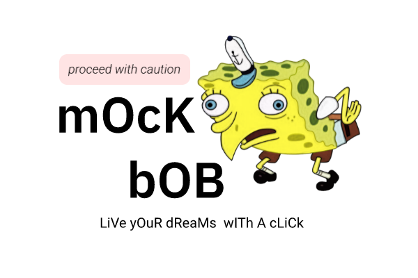

<!--
*** Thanks for checking out this README Template. If you have a suggestion that would
*** make this better, please fork the repository and create a pull request or simply open
*** an issue with the tag "enhancement".
*** Thanks again! Now go create something AMAZING! :D
***
***
***
*** To avoid retyping too much info. Do a search and replace for the following:
*** nyu-ossd-s20, repository, twitter_handle, email
-->

<!-- PROJECT SHIELDS -->
<!--
*** I'm using markdown "reference style" links for readability.
*** Reference links are enclosed in brackets [ ] instead of parentheses ( ).
*** See the bottom of this document for the declaration of the reference variables
*** for contributors-url, forks-url, etc. This is an optional, concise syntax you may use.
*** https://www.markdownguide.org/basic-syntax/#reference-style-links
-->
[![Contributors][contributors-shield]][contributors-url]
[![Forks][forks-shield]][forks-url]
[![Stargazers][stars-shield]][stars-url]
[![Issues][issues-shield]][issues-url]
[![MIT License][license-shield]][license-url]

<!-- PROJECT LOGO -->
<br />
<p align="center">
  <a href="https://github.com/nyu-ossd-s20/mockbob">
    
  </a>

  <h3 align="center">mockbob</h3>

  <p align="center">
    A browser extension to get you that wild emoji, instantenously.
    <br />
    <a href="https://github.com/nyu-ossd-s20/mockbob"><strong>Explore the docs »</strong></a>
    <br />
    <br />
    <a href="https://github.com/nyu-ossd-s20/mockbob">View Demo</a>
    ·
    <a href="https://github.com/nyu-ossd-s20/mockbob/issues">mockbob Bug</a>
    ·
    <a href="https://github.com/nyu-ossd-s20/mockbob/issues">Request Feature</a>
  </p>
</p>


<!-- TABLE OF CONTENTS -->
## Table of Contents

* [About the Project](#about-the-project)
  * [Built With](#built-with)
* [Getting Started](#getting-started)
  * [Prerequisites](#prerequisites)
  * [Installation](#installation)
* [Usage](#usage)
* [Roadmap](#roadmap)
* [Contributing](#contributing)
* [License](#license)
* [Contact](#contact)
* [Acknowledgements](#acknowledgements)


<!-- ABOUT THE PROJECT -->
## About The Project

[![Product Name Screen Shot][product-screenshot]](https://example.com)

Mockbob is here to help you literally make anything sound like satire. Wanna make your school website less boring? One click and done.

<!-- ### Built With

* []()
* []()
* []() -->

<!-- GETTING STARTED -->
## Getting Started

To get a local copy up and running follow these simple steps.

### Development/Contribution Environment

**Install nodejs**
```sh
# If using Ubuntu
curl -sL https://deb.nodesource.com/setup_13.x | sudo -E bash -
sudo apt-get install -y nodejs
```
**Install npm**
```sh
sudo apt-get install npm
```
**Install web-ext**
```sh
npm install --global web-ext
web-ext --version
```
**Clone the repository**
```sh
https://github.com/nyu-ossd-s20/mockbob.git
```

**Test it out**
```sh
cd mockbob/src
web-ext run
```

### Installation

_Coming Soon!_

<!-- USAGE EXAMPLES -->
## Usage

_Coming Soon!_

<!-- ROADMAP -->
## Roadmap

See the [open issues](https://github.com/nyu-ossd-s20/mockbob/issues) for a list of proposed features (and known issues).

<!-- CONTRIBUTING -->
## Contributing

Contributions are what make the open source community such an amazing place to be learn, inspire, and create. Any contributions you make are greatly appreciated.

1. Fork the Project
2. Create your Feature Branch (`git checkout -b feature/AmazingFeature`)
3. Commit your Changes (`git commit -m 'Add some AmazingFeature'`)
4. Push to the Branch (`git push origin feature/AmazingFeature`)
5. Open a Pull Request


<!-- LICENSE -->
## License

Distributed under the MPL-2.0 License. See `LICENSE` for more information.

<!-- CODE OF CONDUCT -->
## Code of Conduct

[We follow these community guidelines](https://www.mozilla.org/en-US/about/governance/policies/participation/)

<!-- CONTACT -->
## Contact

* [Nishant Aswani](https://github.com/niniack)
* [Amad Ansari](https://github.com/amad-a)
* [Charles Thomas](https://github.com/Charleshthomasiii)

Project Link: [https://github.com/nyu-ossd-s20/mockbob](https://github.com/nyu-ossd-s20/mockbob)

<!-- ACKNOWLEDGEMENTS -->
<!-- ## Acknowledgements

* []()
* []()
* []() -->

<!-- MARKDOWN LINKS & IMAGES -->
<!-- https://www.markdownguide.org/basic-syntax/#reference-style-links -->
[contributors-shield]: https://img.shields.io/github/contributors/nyu-ossd-s20/mockbob.svg?style=flat-square
[contributors-url]: https://github.com/nyu-ossd-s20/mockbob/graphs/contributors
[forks-shield]: https://img.shields.io/github/forks/nyu-ossd-s20/mockbob.svg?style=flat-square
[forks-url]: https://github.com/nyu-ossd-s20/mockbob/network/members
[stars-shield]: https://img.shields.io/github/stars/nyu-ossd-s20/mockbob.svg?style=flat-square
[stars-url]:https://github.com/nyu-ossd-s20/mockbob/stargazers
[issues-shield]: https://img.shields.io/github/issues/nyu-ossd-s20/dropmoji.svg?style=flat-square
[issues-url]: https://github.com/nyu-ossd-s20/dropmoji/issues
[license-shield]: https://img.shields.io/github/license/nyu-ossd-s20/dropmoji.svg?style=flat-square
[license-url]: https://github.com/nyu-ossd-s20/dropmoji/blob/master/LICENSE
[product-screenshot]: images/screenshot.png
